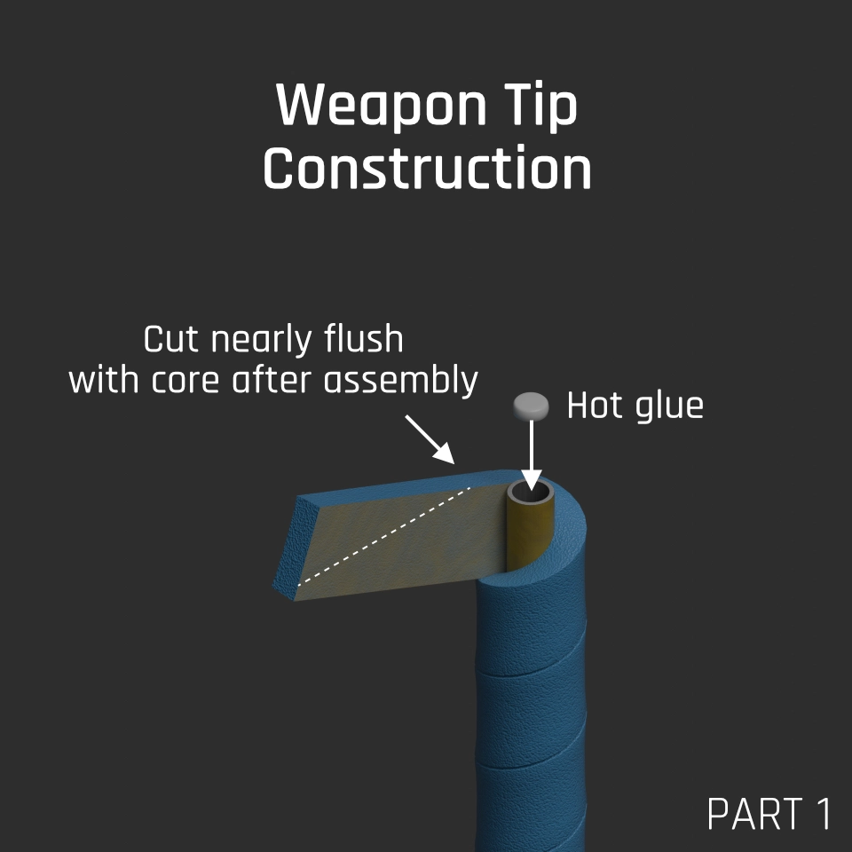
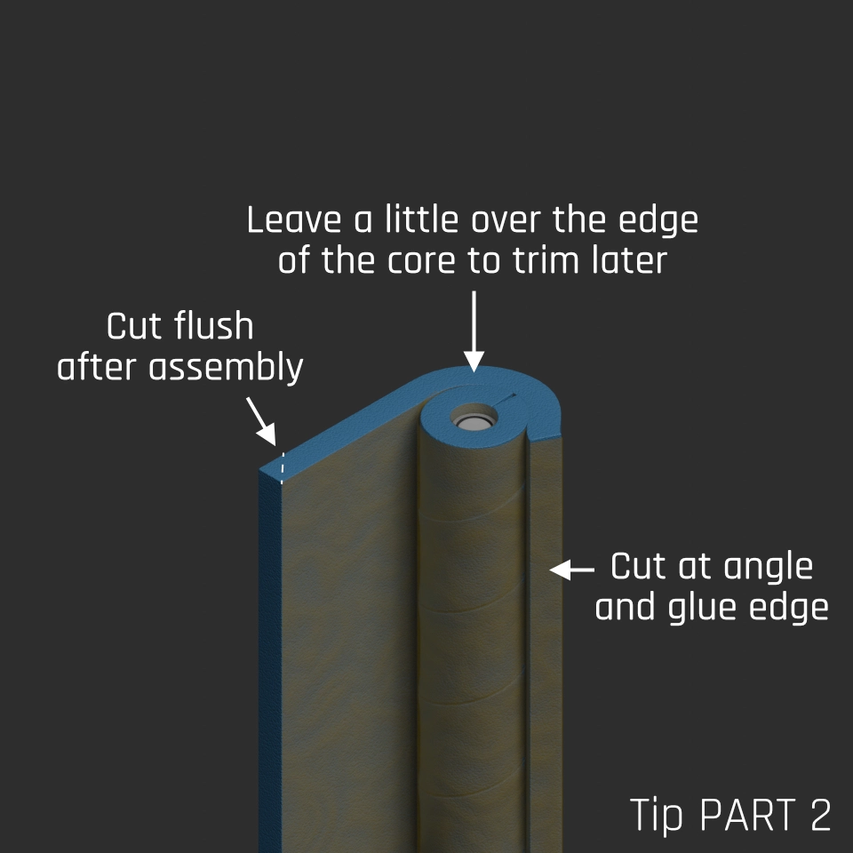
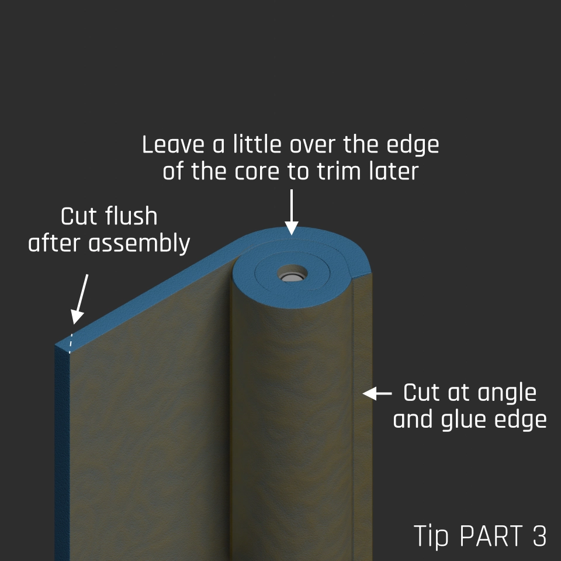
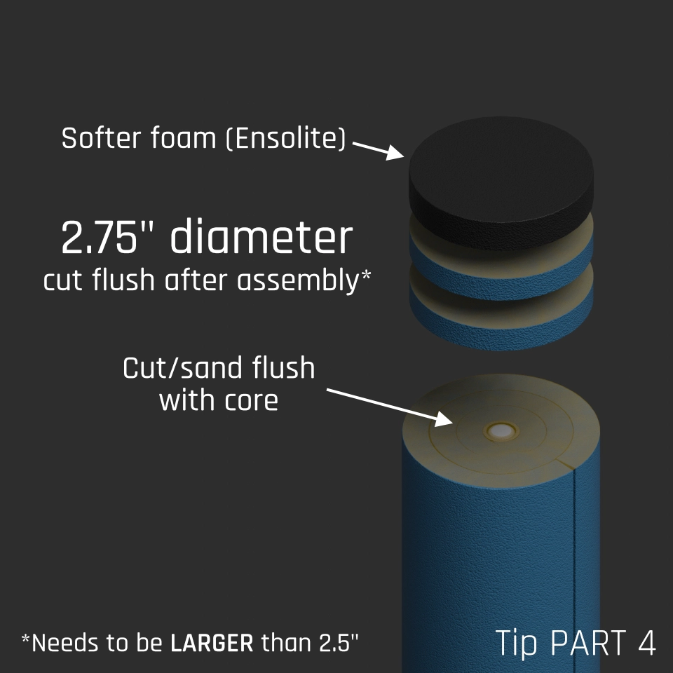
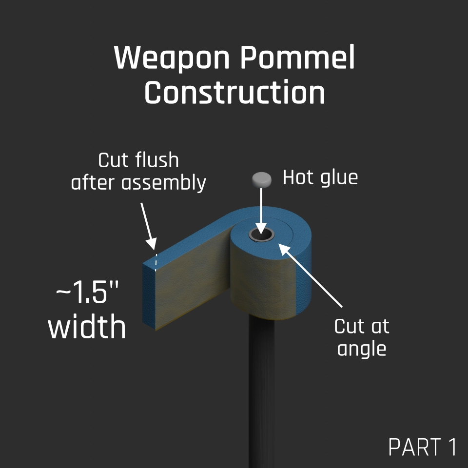
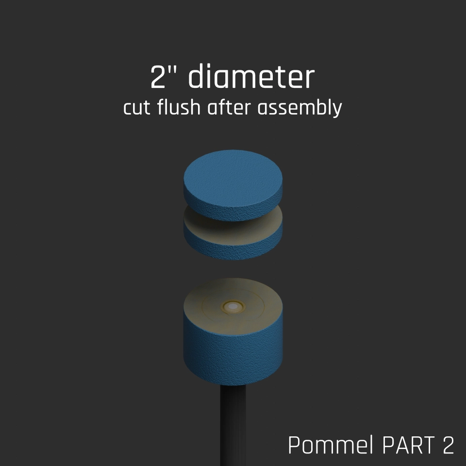
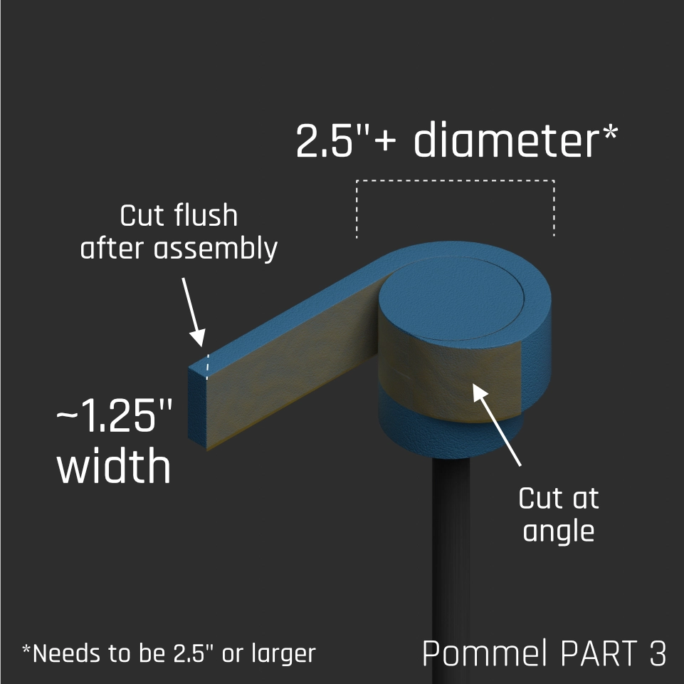

+++
title = "Blue Weapon Construction"
description = "How to build a basic blue weapon, with images"
+++

## Core Selection

[FL-524](https://goodwinds.com/product/fwet-fl-524-x-417-x-75-0-filament-wound-epoxy-tubing/) has become the standard in blue weapon construction, but other types of fiberglass can also be used, either tubing or solid rods. It's cost-prohibitive to use carbon fiber tubes that are strong enough in most situations (most tubes available don't have the correct construction), but possible. Solid carbon fiber can be an option, if a sufficient diameter is selected.

Lengths around 3' are the most common, but can vary per fighter and style - ultimately a length that you're comfortable with and used to will work best.

If your core is hollow, you'll need to fill the holes at the ends with something like hot glue to prevent the core from cutting through the foam on repeated contact.

## Glueing Techniques

Foam is best held together using flexible cements, such as contact cements like Barge or DAP Weldwood. When using these, you need to apply the glue thoroughly to both surfaces and let them dry for <strong>15-20 minutes</strong>. After assembling, pressure is required to ensure full contact between the mating surfaces - in traditional uses, the items are clamped together for a period of time, but this often isn't needed here, and could potentially damage the foam, so isn't recommended.

When attaching foam pieces that have minimal surface area, such as weapon tip caps, you can poke the mating surfaces with an awl or small flathead screwdriver to create more surface area for the glue to attach to. Be sure not to poke the entire way through the foam piece, as this will reduce the effectiveness of the foam.

Glue is depicted as yellow in this guide, and is show on both surfaces whenever possible.

## Tip Construction (stabby/green)

The striking surface for weapons (show in this guide as blue) can be made from foams such as:

* Blue camping mat foam
* [Volara Type 2A](https://www.foambymail.com/product/volara-foam-type-2a.html)

The stabby tip itself (show in this guide as black) can be made from foams such as:

* [Ensolite IV1](https://foamforyou.com/ensolite-foam)
* "Marine" foam, used in boat seats

In this guide, we're constructing an omni-blade using three layers of foam. The tip of the weapon needs to not be able to pass more than 0.5" through a 2.5" hole, when applied perpendicularly. This means the tip of the weapon needs to measure greater than 2.5" in diameter.

### Taping Foam

Generally, tape on a striking/stabbing surface will shear the foam at the tape's edges, due to the tape's inelasticity, so it's recommended to either apply no tape, or full encompass the foam, being sure to use minimal amounts so that it still hits well, and no sharp tape edges are created.

<picture>
  <source srcset="tip_1.webp" type="image/webp"> 
  
</picture>

<picture>
  <source srcset="tip_2.webp" type="image/webp"> 
  
</picture>

<picture>
  <source srcset="tip_3.webp" type="image/webp"> 
  
</picture>

<picture>
  <source srcset="tip_4.webp" type="image/webp"> 
  
</picture>

## Pommel Construction

The pommel can be made from firmer foams, such as EVA or Minicell, but you can also use normal striking surface foams (shown in this guide as blue).

The pommel of the weapon needs to not be able to pass more than 0.5" through a 2" hole, when applied at any angle - this means the minimum diameter of the pommel is 2.5".

Pommels are typically wrapped in cloth/grip tape to cover any exposed foam.

<picture>
  <source srcset="pommel_1.webp" type="image/webp"> 
  
</picture>

<picture>
  <source srcset="pommel_2.webp" type="image/webp"> 
  
</picture>

<picture>
  <source srcset="pommel_3.webp" type="image/webp"> 
  
</picture>

## Covering

Weapon covers are typically simple cylinders with a cap on one end and some sort of drawstring mechanism at the other to hold it onto the weapon. Tape may also be used to hold the cover on, provided it's secured to the handle/haft.

## Weighting

Blue weapons in Belegarth are required to weigh at least 12oz (340g) if they are 24" or longer. Modern weapons nearly always need weight added and the fastest weapons have their additional weight added as close to where you're holding the weapon as possible. This decreases the moment of inertia and allows for faster swinging of the weapon with less energy.

There are many options available, but if you use metal or other hard materials, but sure they are securely fastened to the weapon (as close to the core as possible), and create no sharp edges. Covering things with duct tape, then some sort of cloth/grip tape is a good way to ensure both of these things.